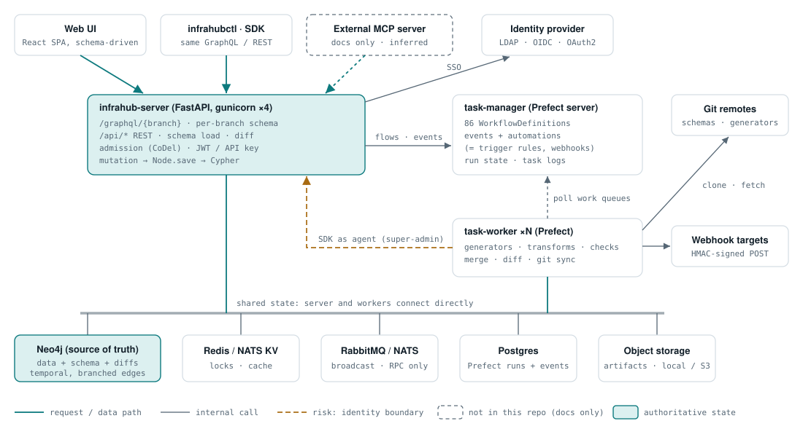
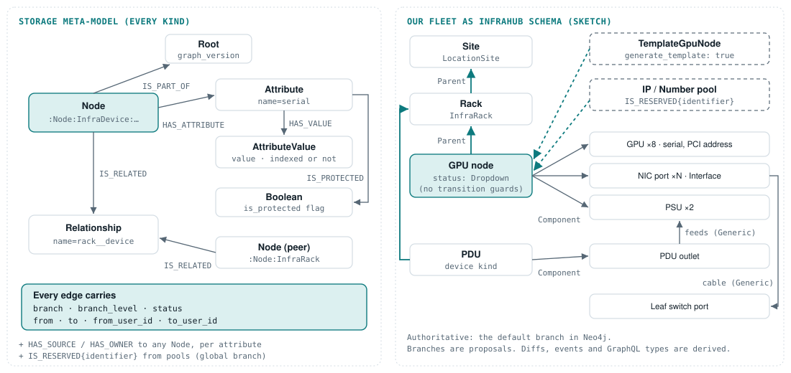
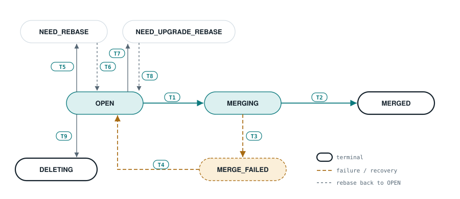
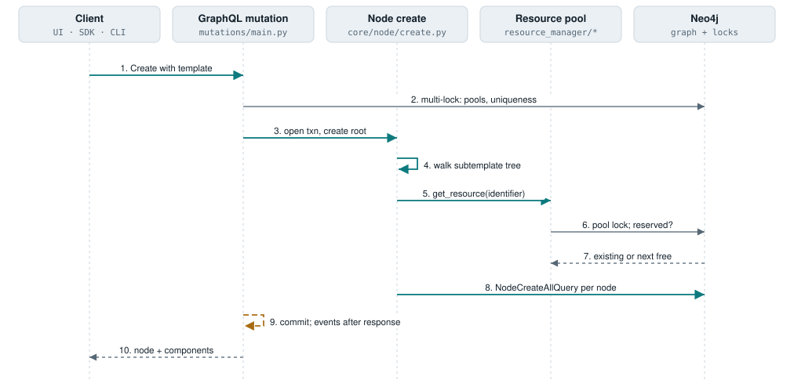
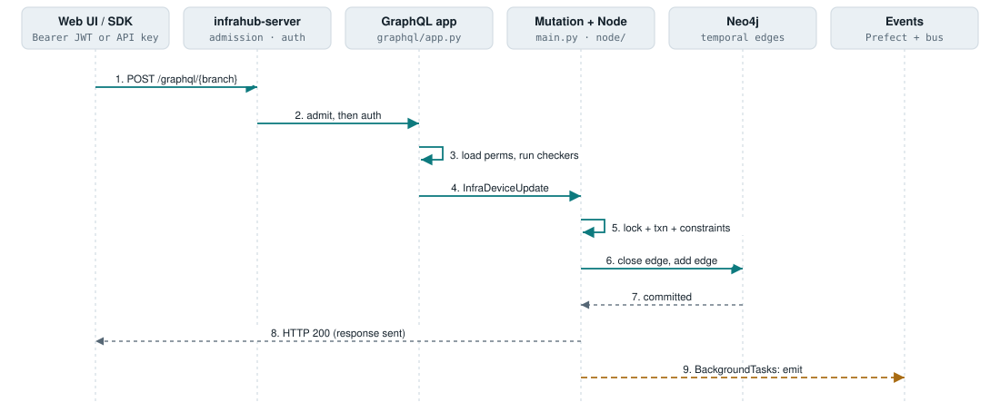
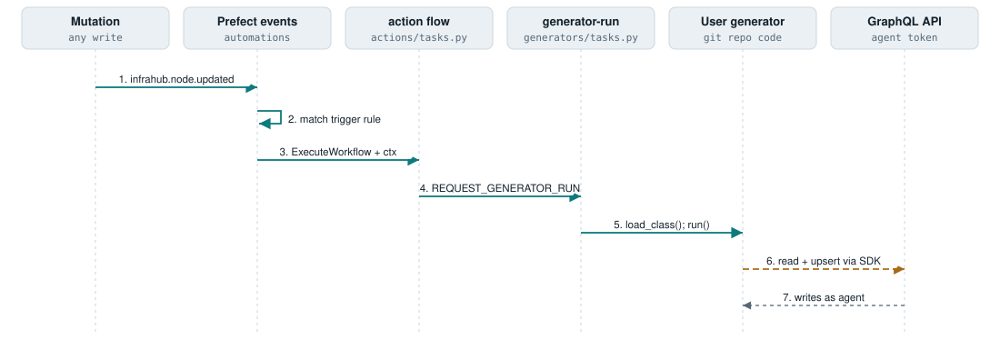
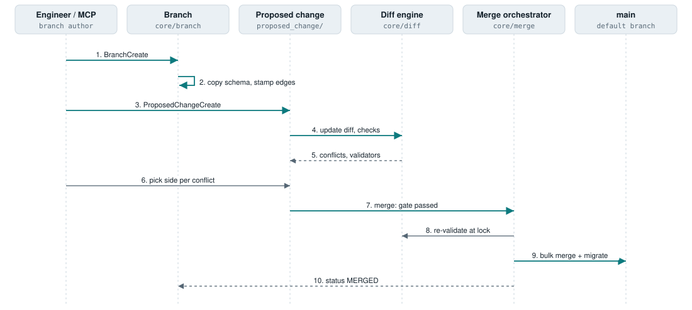

# Infrahub: a branchable, schema-driven graph for infrastructure data

*Architecture review · infrahub*

Infrahub (OpsMill) is a source-of-truth platform. You declare infrastructure kinds in YAML. It stores every object, attribute and relationship in Neo4j with branch and time stamps on each edge, and it generates the GraphQL API and CRUD UI from that schema. Change control is Git-like: branches, diffs, conflict resolution and proposed changes. Automation (generators, transforms, checks, webhooks) runs on Prefect workers.

> **Verdict for us:** adopt the data model (typed schema, temporal per-edge versioning, branch-scoped planning, pools, templates) for inventory and capacity planning. Do not adopt its runtime. It has no lifecycle state machine and no hardware, provisioning or health layer. Workers act as super-admin, and orchestration is Prefect fire-and-forget rather than durable workflows.

- **SHA:** c49e5a4
- **last commit:** 2026-09-29
- **version:** 1.11.3 (CHANGELOG, compose)
- **langs:** Python ≈431k lines · TS/TSX ≈106k · YAML ≈66k
- **license:** Apache-2.0 (Community)
- **stack:** FastAPI · Graphene · Neo4j · Prefect · RabbitMQ · Redis · React
- **unverified:** commit/contributor cadence (clone holds 52 squashed commits)
- **unverified:** python_sdk submodule not checked out
- **unverified:** Enterprise-only code (approvals, log forwarding) not in repo

## Contents

- [In one screen](#in-one-screen)
- [Topology](#topology)
- [Domain model](#domain-model)
- [Lifecycle](#lifecycle)
- [Flow traces](#flow-traces)
- [Components](#key-components)
- [Design decisions](#key-design-decisions)
- [Questions answered](#questions-answered)
- [Adoption cards](#adoption-cards)
- [Fit matrix](#fit-matrix)
- [Anti-patterns](#anti-patterns-and-limitations)
- [Docs vs code](#docs-vs-code)
- [Open questions](#open-questions-and-spike-ideas)
- [Appendix](#appendix)

## In one screen

This repo is a strong reference for the *data plane of truth* and a weak one for the *control plane*.

- **Every edge is versioned, so branches and time travel come for free** — Edges carry `branch`, `from`, `to` and `from_user_id`. An update closes the old edge and adds a new one. A read is a filter over edges (`core/branch/models.py:387-436`).
- **One YAML schema generates the API, the UI and the validators, per branch** — Each kind gets `{Kind}Create/Update/Upsert/Delete` mutations and generic list/detail/form pages. The GraphQL schema is rebuilt for each branch's schema hash (`graphql/manager.py:126-157`).
- **Planning can happen on a branch and merge through a gated change** — Proposed changes run data integrity, schema integrity, generator and user checks. Each conflict needs a chosen side before merge (`proposed_change/tasks.py:244-344`).
- **There is no lifecycle state machine** — A device's status is a `Dropdown`. Nothing guards transitions synchronously. Trigger rules only react after commit (`actions/schema.py:268-318`).
- **Background work is authorised as a super-admin** — Workers call the API with the agent token and swap in the caller's account for attribution, after permissions were already loaded for the agent (`graphql/initialization.py:127`, `graphql/context.py:44`).
- **Plugins are schema extensions plus in-process Git Python, and the UI is closed** — Repository code is imported into the worker with no sandbox (`git/integrator.py:1986-1995`). Frontend routes are compiled in, and the only runtime UI hook is the menu.

## Topology

This is a single-site, hub-and-spoke deployment. The API server and the Prefect workers both connect directly to the same Neo4j, Redis and broker. There are no per-site agents and nothing talks to hardware.

***Everything shares one Neo4j and one lock store.** Workers also call back into the API as the agent account. No component runs at a remote site or talks to BMCs. Sources: `docker-compose.yml` (services), `workers/infrahub_async.py:159-165` (direct DB session), `docker-compose.yml:370` (worker token), `docs/docs/overview/build-with-ai/index.mdx:19,105-111` (MCP, docs only).*

## Domain model

Every kind uses the same meta-model: a `Node` vertex, one `Attribute` vertex per field and one `Relationship` vertex per link. Versioning lives on the edges. Their `InfraDevice` ≈ our node. Their `Interface` ≈ our NIC port. Their resource pools ≈ our IP, ASN and VLAN allocators.

*Legend: Parent (hierarchy, cascade-capable) · Component / Generic relationship · create-time only: template copy, pool allocation · authoritative vertex or edge data*

***Physical and allocated state share one graph. Provenance is per attribute, not per object.** Left: layout from `core/query/node.py:326-338,464-546` and `core/constants/database.py:6-14`. Right: our entities expressed with their relationship kinds (`core/constants/__init__.py:318-326`) and `models/examples/extension_rack.yml`, `extension_power.yml`. The right-hand side is a sketch, not shipped schema.*

### What this means for physical vs logical state

- **They don't separate physical facts from allocated state structurally.** Instead each attribute carries `source` and `owner` edges (`core/query/node.py:333-338`), so a serial set by discovery and a role set by a planner can coexist on one object with different provenance. Reconciliation against reality is not addressed: no discovery or drift code exists in this repo. Their integrations under `models/examples/{netbox,nautobot,ipfabric,slurpit}` are schema mappings only.
- **Branch support is set per attribute.** `aware` fields are versioned per branch, `agnostic` fields live on the global branch, and `local` fields are never merged (`core/constants/__init__.py:174-177`; bulk merge filters to `"aware"`, `core/diff/query/bulk_merge.py:68`). For us this is how operational state (lifecycle, health) could stay out of planning branches.
- **Uniqueness is enforced by the application, not Neo4j.** There are indexes only (`core/graph/index.py:7-40`). A query check runs under a distributed lock named from the hashed values (`core/node/lock_utils.py:136-181`).
- **The schema itself is graph data** (`SchemaNode`/`SchemaAttribute`, `core/schema/definitions/internal.py:533-857`), so it is branched, diffed and migrated like data. About 80 graph migrations live in `core/migrations/graph/`.

## Lifecycle

No resource in Infrahub has a device-style lifecycle. The only explicit state machines are for change control: `Branch.status` and `ProposedChange.state`. The branch one is the better-built of the two and is shown below.

> **Maps to our node lifecycle:** nothing. A GPU node's `racked → provisioning → validating → available` would be a `Dropdown` attribute (for example `models/base/dcim.yml:32-48` has active/provisioning/maintenance/drained) with no transition table and no guards. Attribute validation covers regex, length, enum and choices only (`core/attribute.py:275-318`). Number min/max is enforced only in strict mode (`core/attribute.py:310-311`).

***Guards are scattered across mutation classes, a middleware allowlist and the merge orchestrator. There is no single transition table.** Enum: `core/branch/enums.py:4-14`.*

| # | Transition | Trigger | Guard | Code |
| --- | --- | --- | --- | --- |
| T1 | OPEN → MERGING | BranchMerge / proposed-change merge | Global lock `merge.all_branches`. Status must be OPEN (the merge silently returns otherwise). | `core/branch/tasks.py:370-395`, `core/merge/orchestrator.py:198-209` |
| T2 | MERGING → MERGED | Orchestrator completes | Conflicts and constraints are re-validated under the diff lock before any write. | `core/merge/graph_merger.py:67-130`, `orchestrator.py:162-173` |
| T3 | MERGING → MERGE_FAILED | Lock holder dead past a grace period | Heartbeat or lock liveness check. | `core/merge/failure_identifier.py:89-102` |
| T4 | MERGE_FAILED → OPEN | Operator runs `infrahub recover merge` | Range rollback since `merge_started_at`. Branch delete is blocked until then. | `core/merge/failure_recoverer.py:107-141,285`, `graphql/mutations/branch.py:174` |
| T5 | OPEN → NEED_REBASE | Object type conversion of agnostic nodes | none | `core/convert_object_type/object_conversion.py:177-185` |
| T6 | NEED_REBASE → OPEN | BranchRebase | Refuses any conflict, even a resolved one. Middleware allows only rebase, delete and PC create on NEED_REBASE. | `core/branch/models.py:450`, `core/branch/tasks.py:186-193`, `graphql/middleware.py:9,32` |
| T7 / T8 | OPEN ⇄ NEED_UPGRADE_REBASE | Graph-version upgrade, then rebase | Merge rejects NEED_UPGRADE_REBASE. | `core/branch/tasks.py:89-127`, `graphql/mutations/branch.py:391` |
| T9 | OPEN → DELETING | BranchDelete | Not while MERGE_FAILED. | `graphql/mutations/branch.py:170-178,422` |

**ProposedChange** (OPEN, MERGING, MERGED, CLOSED, CANCELED) is weaker. `validate_state_transition` only restricts CLOSED (`proposed_change/constants.py:44-55`). `ProposedChangeMerge` checks OPEN and then sets MERGING without a lock (`graphql/mutations/proposed_change.py:479-485`). The UI's `ACTION_RULES` table only decides which buttons appear (`proposed_change/action_checker.py:158-205`).

## Flow traces

Neither provisioning flow (a) nor health flow (b) exists in this repo. Below are the closest equivalents: onboarding a node from a template with pool allocations (≈a), a UI write (c), event-driven desired-state generation (≈d), and branch → proposed change → merge (the version-control core).

### F1 · Onboard a node from a template (closest to "a node being provisioned")

***The whole component tree and its IP/number allocations are created in one transaction.** Allocation is idempotent per `identifier`. Events leave after the HTTP response.*

1. **Client → GraphQL mutation.** `{Kind}Create` is sent with `object_template`. `InfrahubMutationMixin.mutate` dispatches on the class suffix (`graphql/mutations/main.py:154,176-179`).
2. **Locks.** A multi-lock is taken over the root's `from_pool` pools (`core/node/lock_utils.py:93-104`) and over uniqueness-constraint hashes (`lock_utils.py:136-181`).
3. **Transaction.** It opens at `core/node/create.py:538`. The root node is built from the template, and copied values are stamped `source=template.id` (`create.py:179-180`).
4. **Subtemplate walk.** `handle_template_relationships` reads subtemplates one level at a time and creates components depth-first (`create.py:97-141,322-397`). For us, this is a BOM expanding into GPUs, NICs and PSUs.
5. **Per-component allocation.** `_from_resource_pool` relationships call `get_resource` for each component (`create.py:233-283`).
6. **Pool.** The pool takes a pool-scoped lock and looks up an existing reservation by `identifier`. If one exists it is returned (idempotent). Otherwise the pool allocates the next free resource and saves it (`core/node/resource_manager/ip_prefix_pool.py:45-103`).
7. **Reservation edge.** `IS_RESERVED{identifier}` is written on the *global* branch, so it is visible to every branch (`core/query/resource_manager.py:159-171`).
8. **Node write.** Each node is one Cypher statement, `NodeCreateAllQuery` (`core/query/node.py:161,545`).
9. **Commit, then events.** Events are queued as Starlette BackgroundTasks after the response (`graphql/mutations/main.py:238`, `graphql/app.py:301`). A crash here loses them.
10. **Not in code:** BMC/Redfish discovery, PXE, image or firmware, burn-in. Anything after "the record exists" is out of scope.

Risk seen here: the pool lock is released when `get_resource` returns, but the transaction commits later, and mutation-level locks cover only root-level pools. Nested template allocations may therefore race (inferred; needs a concurrency test).

### F2 · A user edits a device attribute (UI or CLI → the thing that changes)

***UI, CLI and SDK all take the same path.** Authorisation is per kind, and the "change" is an append-only edge swap. Nothing outside the database changes.*

1. **ASGI stack.** CORS → admission (CoDel, client `X-Priority`) → GZip → Prometheus → CorrelationId (`server.py:217-246`). OpenTelemetry is set up at `server.py:163`.
2. **Authentication.** `InfrahubGraphQLApp.__call__` accepts a JWT, API key or cookie, then resolves the branch (`graphql/app.py:119-136`).
3. **Permissions.** They are loaded per request (`graphql/initialization.py:127-131`). The checker chain runs, ending in `ObjectPermissionChecker` with per-kind CRUD (`graphql/api/dependencies.py:27-41`; `graphql/auth/query_permission_checker/object_permission_checker.py:24-67`).
4. **Branch-status middleware.** It blocks mutations on branches that are not writable (`graphql/middleware.py:15-37`).
5. **Mutation.** `mutate_update` is wrapped in `@retry_db_transaction` (`graphql/mutations/main.py:322`). It takes a lock, opens a transaction, runs constraints and profiles, then calls `obj.save` (`main.py:286-372`).
6. **Save.** `Node._update` issues one query per changed attribute or relationship, then recomputes HFID and display label (`core/node/__init__.py:1152-1192`).
7. **Cypher.** The current `HAS_VALUE` edge is closed with `to`/`to_user_id` and a new edge is created (`core/query/attribute.py:85-99`).
8. **Response, then events.** The response is returned, and then `InfrahubEventService.send` fans the event out to the bus, Prefect and log forwarding (`services/adapters/event/__init__.py:30-48`).

### F3 · Event → trigger rule → generator (closest to "desired state reconciled")

***Trigger rules are data compiled into Prefect automations.** The only built-in actions are "run generator" and "change group membership". The generator's writes come back as the agent account.*

1. **Event.** A mutation emits `infrahub.node.updated`, carrying `context` in the payload (`graphql/mutations/main.py:51-80`).
2. **Automation.** `CoreNodeTriggerRule` is compiled into a Prefect automation that matches kind, branch scope and attribute value, including `value_previous` (`actions/models.py:84-151`; `actions/schema.py:268-318`). It is synced by `configure_action_rules` (`actions/tasks.py:208-221`).
3. **ExecuteWorkflow.** The action is `ACTION_RUN_GENERATOR`, with context templated from the event (`actions/models.py:152-168`).
4. **Action flow.** It sets `client.request_context` (`actions/tasks.py:159-180`), then submits `REQUEST_GENERATOR_RUN` (`actions/tasks.py:244-316`).
5. **generator-run.** It loads the user's class from the Git worktree with `load_class` and calls `run()` (`generators/tasks.py:37-110`, `:88`, `:103`).
6. **Identity is dropped.** `RequestGeneratorRun` has no context field (`generators/models.py:18-33`), so writes are attributed to the agent. The proposed-change path does set context (`proposed_change/tasks.py:956`).

Generators are idempotent "compute desired objects from a query, upsert them, prune the rest" routines. That is a reconcile loop over *records*, not over hardware. No timeouts, retries or idempotency keys are set at the flow level (`services/adapters/workflow/worker.py:84-122`).

### F4 · Branch → proposed change → merge (version-control core)

***Merge is gated twice, at proposed-change level and again under the merge lock.** It is not atomic: it runs as several bulk transactions backed by range rollback.*

1. **BranchCreate.** The origin schema is copied under a distributed lock. `BranchCreatedEvent` is emitted, and a git branch is created if `sync_with_git` is set (`core/branch/creator.py:55-90`).
2. **Writes on the branch** stamp `branch=<name>` on new edges. Reads union main at `branched_from` with the branch at `at` (`core/branch/models.py:280-300,387-436`).
3. **ProposedChangeCreate** submits `REQUEST_PROPOSED_CHANGE_PIPELINE` (`graphql/mutations/proposed_change.py:139-143`).
4. **Pipeline.** Git conflict check first. Then diff update, artifacts, generators, data integrity, repository checks, schema integrity and user tests (`proposed_change/tasks.py:1179-1314`). The diff is stored as a graph: DiffRoot → DiffNode → DiffAttribute → DiffConflict (`core/diff/query/save.py`).
5. **Conflicts.** A human picks a side (`core/diff/query/update_conflict_query.py:28`; `graphql/mutations/diff_conflict.py:56-77`).
6. **Merge gate.** The injectable checker runs first (a no-op in Community). Every non-data validator must be SUCCESS and every conflict needs `keep_branch` (`proposed_change/tasks.py:244-344`).
7. **merge_branch.** Takes the global lock and re-checks OPEN (`core/branch/tasks.py:370-395`). The orchestrator protects main, marks MERGING, re-validates, and runs bulk merge queries (`core/diff/merger/merger.py:100-138`). Schema migrations run at `merge_at` (`core/merge/orchestrator.py:119-143`).
8. **MERGED.** Then events, the git merge (*after* MERGED, so the two can diverge), and a diff update for every open branch (`core/merge/post_merge.py:67-181`; `core/branch/tasks.py:608-625`).

## Key components

Almost all the value is in the core graph layer and the schema system. The rest is conventional FastAPI + Prefect plumbing.

| Component | Responsibility | Tech | Key files | Talks to |
| --- | --- | --- | --- | --- |
| API server | GraphQL and REST, auth, admission, schema load | FastAPI, Graphene, gunicorn | `server.py`, `graphql/app.py`, `api/__init__.py:31-45` | Neo4j, Redis, broker, Prefect |
| GraphQL manager | Generates types and mutations per branch schema hash | Graphene | `graphql/manager.py:126-157,539-593`, `graphql/registry.py:194-212` | Schema manager |
| Core graph layer | Node, attribute and relationship CRUD as temporal Cypher | Neo4j driver 6 | `core/node/__init__.py`, `core/attribute.py`, `core/query/node.py`, `core/query/attribute.py` | Neo4j |
| Schema system | Load, validate, inherit and generate Profile/Template kinds; migrations | Pydantic | `core/schema/schema_branch.py:722-792`, `core/schema/manager.py`, `core/validators/__init__.py:23-53`, `core/migrations/schema/__init__.py` | Neo4j, locks |
| Diff and merge | Incremental diff stored as a graph, conflict detection, merge, rollback | Cypher bulk queries | `core/diff/coordinator.py`, `core/diff/conflicts_enricher.py`, `core/merge/orchestrator.py`, `core/merge/failure_recoverer.py` | Neo4j, locks, git |
| Proposed change | Pipeline of checks and gated merge | Prefect flows | `proposed_change/tasks.py:1179-1314,244-344` | Diff, generators, repos |
| Resource managers | IP prefix, address and number pools | Locks + reservation edges | `core/node/resource_manager/*.py`, `core/query/resource_manager.py` | Neo4j, locks |
| Workflow catalogue and workers | 86 static flows; async worker | Prefect 3 | `workflows/catalogue.py`, `workflows/models.py:44-100`, `workers/infrahub_async.py` | Prefect, Neo4j, API |
| Events, triggers, actions | Event types, trigger rules compiled into Prefect automations | Prefect events | `events/`, `actions/models.py:84-245`, `trigger/`, `webhook/` | Prefect, broker |
| Git integrator | Syncs repos and imports schema, queries, transforms, checks and generators | GitPython, importlib | `git/integrator.py:356-445`, `git/repository.py` | Git remotes, API |
| Permissions | Account → group → role → global or object permission | custom | `permissions/`, `graphql/auth/query_permission_checker/` | Neo4j |
| Locks | Distributed, re-entrant locks (no TTL by default) | Redis / NATS KV | `lock.py:151-262`, `core/node/lock_utils.py`, `locks/cleaner.py` | Redis/NATS |
| Frontend | Schema-driven generic CRUD; custom pages for core kinds | React 19, Vite | `frontend/app/src/app/router.tsx`, `shared/components/form/dynamic-form.tsx` | GraphQL/REST |

## Key design decisions

Two decisions drive everything else. Attributes are vertices, and versions are edge stamps. Together they give per-field provenance, branching and history, at the cost of read and write amplification.

### D1 · Attribute-as-vertex property graph

- **Decision:** Each attribute and relationship is its own vertex, reached through versioned edges from the Node.
- **Alternatives:** Properties on the node vertex; relational columns; JSON documents. The alternatives are not recorded in an ADR; inferred.
- **Why:** Makes value, `source`, `owner` and `is_protected` versionable per field and per branch.
- **Cost:** One query per changed field on update (`core/node/__init__.py:1161-1172`). Every read resolves edge versions hop by hop (`dev/knowledge/backend/query-pattern.md:228-256`).
- **Source:** `core/query/node.py:326-338`, `dev/knowledge/backend/database-schema.md`

### D2 · Branches as edge stamps, not database copies

- **Decision:** Branch data is stored in the same graph, with `branch`, `branch_level`, `from` and `to` on each edge. The depth limit is 2.
- **Alternatives:** Clone the database per branch; event-sourced replay. Inferred.
- **Why:** Branches are cheap to create, and a diff is a query over edges. Time travel falls out of the same filter.
- **Cost:** Every query carries branch/time predicates. Rebase and rollback rewrite history (`core/branch/models.py:453-466`; `core/rollback.py:21-60`).
- **Source:** `core/branch/models.py:37,387-436`

### D3 · Schema stored as graph data and branched

- **Decision:** The schema lives in the `Schema` namespace as nodes. Each branch has its own schema and `schema_hash`. Merge performs a three-way schema diff and runs migrations.
- **Alternatives:** Code-defined models (like NetBox or Nautobot); a single global schema.
- **Why:** Users can evolve the model through the same review flow as data.
- **Source:** `core/schema/definitions/internal.py:533-857`, `core/merge/schema_analyzer.py:61-123`

### D4 · Generated user-facing schema contract (ADR 0010)

- **Decision:** Field visibility (`write ⊆ read ⊆ internal`) generates SDK models, and the server validates schema payloads through them.
- **Alternatives:** Hand-maintained second model set (rejected because of drift).
- **Why:** One definition feeds the server, the SDK and the published JSON schema.
- **Cost:** Changes span two repositories, and the server depends on an SDK release.
- **Source:** `dev/adr/0010-generated-user-facing-schema-contract.md`, `api/schema.py:134-173`

### D5 · Prefect for async tasks and events (ADR 0002, 0003)

- **Decision:** All background work is a Prefect flow declared in a static catalogue. Events and automations use Prefect's event store.
- **Alternatives:** The previous message-bus task execution (ADR 0004 describes the migration away from it).
- **Why:** A pure-Python stack that is embeddable and testable, with a run UI and logs.
- **Cost:** No durable-execution semantics, no idempotency keys, fire-and-forget submission (`services/adapters/workflow/worker.py:99-122`). ADR 0003 says Enterprise can inject workflows through dependency injection; Community has no hook.
- **Source:** `dev/adr/0003-asynchronous-tasks.md`, `workflows/catalogue.py`

### D6 · Message bus kept only for broadcast and RPC (ADR 0004)

- **Decision:** RabbitMQ or NATS handles registry refresh broadcasts and sub-second RPC such as `git.file.get`.
- **Why:** Workflows cover everything else, and broadcasts need fan-out to every worker.
- **Source:** `dev/adr/0004-message-bus.md`, `services/adapters/message_bus/rabbitmq.py:138-157`

### D7 · Merge recovery by invariant-based range rollback, not a write log

- **Decision:** A merge is several transactions. On failure, every edge written since `merge_started_at` is reverted, either in-process or through `infrahub recover merge`.
- **Alternatives:** A single transaction (too large); an undo log.
- **Why:** Bulk merges exceed practical transaction size.
- **Cost:** Correct only while the write-scoping invariants hold. Git is not reverted.
- **Source:** `core/merge/rollback_handler.py:63-108`, `core/merge/failure_recoverer.py`, `dev/knowledge/backend/merge-failure-recovery.md:100-117`

### D8 · Per-worker coordination-free admission control (ADR 0007–0009)

- **Decision:** Each worker runs CoDel with a DB-stress signal and a client-declared `X-Priority`. It sheds load with 429 and `Retry-After`.
- **Why:** Protects Neo4j under bursts without shared state.
- **Source:** `api/admission/*`, `server.py:68-75,241`, `database/load_signal.py`

## Questions answered

Short answers to the brief. Items marked "not addressed" have no code in this repo.

| Question | Answer |
| --- | --- |
| Core entities and where they live | User-defined kinds in YAML (for example `models/base/dcim.yml`), stored in Neo4j. Built-in kinds cover accounts, branches, repositories, pools, menus, triggers and webhooks (`core/schema/definitions/core/*.py`). |
| Authoritative vs projected | Authoritative: the default branch in Neo4j. Projected or cached: stored diffs, per-branch GraphQL schema, Prefect events (retention ~7 days per `dev/knowledge/backend/telemetry.md`, not verified in code), artifacts in object storage. |
| Physical vs logical state | Not separated structurally. Per-attribute `source`/`owner` and per-attribute `branch_support` are the tools. |
| Discovery and reconciliation | Not addressed. External integrations are schema mappings in `models/examples/` only. |
| State machine | Only for Branch and ProposedChange (see [Lifecycle](#lifecycle)). Nothing for resources. |
| Orchestration style | Prefect flows plus event-triggered automations. Generators are record-level reconcilers. |
| Long, failure-prone steps | DB transient retries (`database/__init__.py:602-627`). Webhook retry is bounded (ADR 0015). Retry and cancel exist for webhook tasks only (ADR 0014, `graphql/mutations/task.py:143,177`). There are no flow timeouts or idempotency keys. |
| Bulk safety (batching, canaries) | Not addressed for operations. For data: proposed-change checks, global merge lock and admission control. |
| IPMI / Redfish / PXE / images / firmware | Not addressed. |
| Health signals, validation, burn-in | Not addressed. "Checks" validate data in proposed changes, not hardware. |
| Metrics, logs and traces | Prometheus `/metrics` (`server.py:219,253`) and OTLP traces (`trace.py:70-93`). Trace context is not propagated across Prefect flow dispatch, only over NATS (`services/adapters/message_bus/nats.py:87-114`). |
| API style and versioning | GraphQL generated per branch plus REST under `/api`. There is no API versioning; the contract is the schema. |
| Plugin model | Runtime schema extensions, and Git repositories that ship transforms, checks, generators, queries, objects and menus. Workflows, actions, events and UI are not extensible. See [cards](#adapt--schema-extensions-so-other-teams-can-add-fields-to-core-kinds). |
| AuthN / AuthZ / audit | JWT HS256, API keys, OIDC/OAuth2 PKCE and LDAP. Kind-level RBAC with branch-scoped decisions. No tenancy and no instance-level permissions. Audit comes from edge `from_user_id` plus events. |
| MCP / AI | None in the product code. The docs describe an external MCP server that writes on `mcp/session-*` branches and opens proposed changes, with no merge tool (docs only). |
| Multi-site topology | Not addressed. Single control plane, shared stores. |
| Deploy and upgrade | Docker Compose with Neo4j, RabbitMQ, Redis, Prefect and Postgres. `infrahub upgrade` runs graph migrations, then schema, then a branch rebase (`cli/upgrade.py:154-218`). On a stale graph the server only logs a warning at startup; it does not refuse to start (`server.py:125`, `database/graph.py:16-22`). Helm values are in `development/k8s/`; the chart is external. |
| Cadence | CHANGELOG lists 13 releases from v1.10.2 (2026-07-03) to v1.11.3 (2026-09-23), roughly weekly patches. Commit and contributor counts can't be measured from this clone. |

## Adoption cards

Take the modelling and change-control patterns. Rebuild the runtime patterns on Temporal with real identity propagation.

### Adopt

#### Adopt · Declarative schema with generics and typed relationship kinds

Kinds are defined in YAML with `inherit_from` generics, 23 attribute kinds, and relationship kinds `Parent/Component/Generic/Attribute` with cardinality and `on_delete` cascade. Parent/Component graphs must be acyclic (`core/schema/schema_branch.py:1168-1207`; `core/constants/__init__.py:318-356`).

- **Maps to:** inventory
- **Effort / risk:** M. Risk: over-generic models. Keep a small fixed core (site, rack, node, GPU, NIC, PDU, CDU).
- **Portal fit:** The schema is the plugin contract for entity types.

#### Adopt · Per-attribute branch support: aware, agnostic, local

Each field declares whether it forks with branches, is global, or stays local and never merges. Bulk merge only moves `aware` data (`core/diff/query/bulk_merge.py:68`; `core/attribute.py:188-190`).

- **Maps to:** inventory, lifecycle
- **Effort / risk:** S, as a concept. Risk: users misunderstand why a planning branch can't change lifecycle state.
- **Temporal fit:** Lifecycle and health fields are agnostic. Only the lifecycle workflow writes them, never a planning branch.

#### Adopt · Identifier-keyed, idempotent pool allocation

`get_resource(identifier)` takes a pool lock. It returns an existing reservation for the same identifier or allocates the next free resource. The reservation is an `IS_RESERVED` edge on the global branch (`core/node/resource_manager/ip_prefix_pool.py:45-103`; `core/query/resource_manager.py:159-171`).

- **Maps to:** provisioning, inventory
- **Effort / risk:** S. Risk: releases. Their number reservations are never cleaned up (`resource_manager.py:391-397`).
- **Temporal fit:** Use the workflow ID plus the node as the identifier, so activity retries return the same IP, ASN or VLAN.

#### Adopt · Object templates that expand a component tree

`generate_template: true` creates `Template<Kind>` kinds. Instantiation creates components depth-first in one transaction, with per-component pool allocations and `source=template` provenance (`core/node/create.py:97-141,179-180,233-283`).

- **Maps to:** inventory (BOM)
- **Effort / risk:** M. Risk: copy-at-create means later template edits don't propagate. Add drift reporting of node vs SKU template.
- **Portal fit:** "Add rack from SKU" is one action.

#### Adopt · Per-field provenance and actor on every change

Every edge records `from_user_id`/`to_user_id`. Attributes can point `HAS_SOURCE`/`HAS_OWNER` to any node, such as a repository, a discovery job or a team (`core/query/node.py:258-268,333-338`).

- **Maps to:** inventory, authz (audit)
- **Effort / risk:** M. Risk: storage growth. Keep provenance on physical facts (serials, firmware), not on every field.
- **Portal fit:** A "who set this and from where" panel on every field.

#### Adopt · Point-in-time reads (`?at=`) over append-only history

An update closes the current edge and opens a new one. Any query takes `at` (`core/query/attribute.py:85-99`; `graphql/initialization.py:104,141`). REST rejects an `at` earlier than the branch (`branch/query_time_validator.py:17-36`).

- **Maps to:** inventory, validation (RMA forensics)
- **Effort / risk:** M on Postgres (valid-time ranges), S if you use Infrahub. Risk: rebase and rollback in Infrahub rewrite history, so it isn't strictly immutable.

#### Adopt · One schema generates the API, typed clients and generic UI

Every kind gets `Create/Update/Upsert/Delete` plus filtered queries (`graphql/manager.py:539-593`). The UI renders lists, details and forms by attribute kind (`frontend/app/src/shared/components/form/dynamic-form.tsx:70-92`).

- **Maps to:** portal
- **Effort / risk:** M. Risk: generic CRUD bypasses lifecycle rules. Expose state-changing fields only through actions.
- **Portal fit:** Extend generation to the CLI and to MCP tool descriptors from the same schema.

#### Adopt · Schema-planned, permission-pruned path and reachability queries

`InfrahubPathTraversal`/`InfrahubReachableNodes` plan legal hops from the schema, prune by the caller's view permissions, and run a bidirectional BFS with a depth cap (default 5, max 30) and timeouts (`graph_traversal/planning/planner.py`; `graphql/queries/path.py:31`).

- **Maps to:** inventory, validation
- **Effort / risk:** M. Risk: query cost at 100k-node scale.
- **Portal fit:** Blast-radius panel: "which GPUs lose power or fabric if PDU-7 or leaf-3 fails".

### Adapt

#### Adapt · Branch + proposed change for capacity and fabric plans

Plans live on a branch. The pipeline runs integrity checks and generators, and conflicts need an explicit side before merge (`proposed_change/tasks.py:1179-1314,244-344`).

**Change:** use branches only for planning data (BOM, rack elevations, cabling plans), never for operational state. Re-run checks on every branch change: theirs only run on create or on request, so they go stale (`graphql/mutations/proposed_change.py:132-140,262-271`).

- **Maps to:** inventory (capacity planning)
- **Effort / risk:** L. Risk: merge cost and a global merge lock on large plans.
- **Temporal fit:** Merge emits an event; a Temporal "apply plan" workflow turns it into provisioning work.

#### Adapt · Status-gated action allowlist

A middleware blocks every mutation on a NEED_REBASE branch except an allowlist (`graphql/middleware.py:9,32`). Merge refuses bad statuses (`graphql/mutations/branch.py:386-395`).

**Change:** make it a declarative transition table (state × action → next state, guard) owned by the lifecycle workflow. The API rejects actions not allowed in the current state before starting a workflow.

- **Maps to:** lifecycle
- **Effort / risk:** M. Risk: the table and the workflow disagree. Generate one from the other.
- **Temporal fit:** The entity workflow owns state and the API only signals it. The table is shared so the portal can grey out actions.

#### Adapt · Trigger rules as data (kind, branch, attribute from→to)

`CoreNodeTriggerRule` plus match nodes compile into Prefect automations. They can match `value_previous`, which makes them transition-aware (`actions/models.py:84-245`; `actions/schema.py:268-318`).

**Change:** the action is "signal or start Temporal workflow X with this input". Deliver through a transactional outbox rather than post-response background tasks.

- **Maps to:** orchestration
- **Effort / risk:** M. Risk: trigger storms on bulk edits. Add rate limits per rule.

#### Adapt · Schema `extensions:` so other teams can add fields to core kinds

`extensions.nodes` may only add attributes and relationships to existing kinds (`core/schema/__init__.py:35-46,65-70`; merged at `schema_branch.py:717-720`). Example: `models/examples/extension_power.yml:183-191`.

**Change:** their extensions skip the restricted-namespace check (`core/schema/__init__.py:103-110`). Require plugin-namespaced field names and an owning team, and route schema changes through review.

- **Maps to:** portal, inventory
- **Effort / risk:** M. Risk: plugins making core kinds heavier to read.
- **Portal fit:** A plugin's contract is its schema extension plus actions plus panels.

#### Adapt · Generators: desired-state records from a query

A generator runs a GraphQL query and upserts derived objects, such as fabric links from a rack plan. It runs as a proposed-change check or on a trigger (`generators/tasks.py:37-110`; `proposed_change/tasks.py:900-962`).

**Change:** run them as Temporal activities under the caller's identity (theirs drop it, `generators/models.py:18-33`), in a sandbox, with dry-run diffs.

- **Maps to:** provisioning (plan expansion), orchestration
- **Effort / risk:** M. Risk: generator loops. Add convergence detection.

#### Adapt · Permissions with branch-relative decisions

Account → group → role → global or object permission. The object decision is a bitflag for default vs other branches, checked per kind (`graphql/auth/query_permission_checker/object_permission_checker.py:24-67`).

**Change:** keep "may edit planning branches but not main". Add instance-level and attribute scopes (site, tenant, owning team) through a ReBAC engine. Their model is kind-level only and has no tenancy.

- **Maps to:** authz
- **Effort / risk:** M. Risk: two permission systems drifting apart.

#### Adapt · Menu as data with `required_permissions`

`CoreMenu`/`CoreMenuItem` nodes, loaded from Git or `models/base_menu.yml`, drive the sidebar (`core/schema/definitions/core/menu.py:10-76`).

**Change:** theirs can only link to built-in SPA routes (`sidebar-menu-section-object.tsx:37,56`). Ours must reference plugin-registered views.

- **Maps to:** portal
- **Effort / risk:** S. Risk: low.
- **Portal fit:** Works with a Backstage or custom shell.

#### Adapt · AI agents write to branches; humans merge

The docs describe an external MCP server that writes on `mcp/session-*` branches, opens a proposed change and has no merge tool (`docs/docs/overview/build-with-ai/index.mdx:19,105-111`). Docs only; the server is not in this repo.

**Change:** apply the pattern to plan edits only. For operational actions, use Temporal workflows with approval signals under the caller's identity.

- **Maps to:** portal, authz
- **Effort / risk:** S. Risk: branch sprawl.

#### Adapt · Profiles: live, prioritised defaults

Profiles apply values by `profile_priority`, with `is_from_profile` provenance, and are refreshed when they change (`profiles/node_applier.py:96`; `profiles/tasks.py:33-86`).

**Change:** use them for desired config (BIOS or firmware baseline per SKU) and compare against observed values to detect drift.

- **Maps to:** provisioning, inventory
- **Effort / risk:** M. Risk: implicit values surprise operators.

### Avoid

#### Avoid · Workers act as a super-admin and swap in the caller for attribution

Workers use the agent token (`docker-compose.yml:370`). The agent is in Super Administrators (`core/initialization.py:541,592-598`). Permissions are loaded for the agent before `OVERRIDE_CONTEXT` swaps the account (`graphql/initialization.py:127`; `graphql/context.py:31-44`).

**Why avoid:** it breaks "every action under the caller's identity". Use token exchange or on-behalf-of credentials per workflow and check authz inside activities.

- **Maps to:** authz, orchestration
- **Effort / risk:** —

#### Avoid · Plugin code imported into shared workers

Repository Python is added to `sys.path` and imported with `importlib`, both at sync time and at run time (`git/integrator.py:1094-1107,1986-1995,2061-2070`). The only guard is path containment (`git/base.py:1103-1119`). The worker holds a DB session.

**Why avoid:** anyone who can push to a registered repo gets DB-level access. Run plugin workflows on each team's own Temporal task queue and workers.

- **Maps to:** portal, orchestration
- **Effort / risk:** —

#### Avoid · Fire-and-forget flow submission without idempotency or timeouts

`submit_workflow` calls `run_deployment(timeout=0)`. `execute_workflow` polls with no timeout. No `idempotency_key` is used anywhere (`services/adapters/workflow/worker.py:84-122`). The catalogue is a closed static list (`workflows/catalogue.py:687,778-786`).

**Why avoid:** Temporal already gives workflow-ID dedupe, timeouts and durable retries. Don't copy this layer.

- **Maps to:** orchestration
- **Effort / risk:** —

#### Avoid · Events emitted as post-response background tasks

Events are built after commit and sent by Starlette BackgroundTasks once the response is sent. They are skipped when there is no account session (`graphql/mutations/main.py:51-80,238`; `graphql/app.py:301`).

**Why avoid:** events that drive workflows need a transactional outbox or CDC, or an in-workflow write followed by a signal.

- **Maps to:** orchestration
- **Effort / risk:** —

### Watch

#### Watch · Multi-transaction merge with range rollback and failure detection

A dead lock holder flips the branch to MERGE_FAILED. Recovery reverts every edge since `merge_started_at` (`core/merge/failure_identifier.py:50-102`; `core/merge/failure_recoverer.py:107-141`).

- **Maps to:** orchestration, inventory
- **Effort / risk:** L. Risk: depends on invariants listed in `merge-failure-recovery.md:100-117`. Useful only if we build branching ourselves.

#### Watch · Coordination-free admission control with client priority

Per-worker CoDel plus a DB-stress signal, with `X-Priority` from clients. Responses are 429 with `Retry-After` (`api/admission/*`; ADR 0007–0009).

- **Maps to:** portal, multi-site
- **Effort / risk:** M. Risk: `X-Priority` is trusted from the client. Tie it to identity.

#### Watch · Incremental diffs stored as a graph

Diff slices are cached and only the gaps are recomputed. Conflicts are nodes with a `selected_branch` (`core/diff/coordinator.py:596-678`; `core/diff/query/save.py`).

- **Maps to:** inventory
- **Effort / risk:** L. Risk: the merge loads the full diff into memory for the changelog (`core/merge/orchestrator.py:112`).

## Fit matrix

Coverage is strong for inventory and portal data, partial for orchestration and authz, and absent for provisioning, validation and multi-site.

| Our area | Adopt | Adapt | Avoid | Not addressed |
| --- | --- | --- | --- | --- |
| **inventory** | [schema](#adopt--declarative-schema-with-generics-and-typed-relationship-kinds)[branch support](#adopt--per-attribute-branch-support-aware-agnostic-local)[pools](#adopt--identifier-keyed-idempotent-pool-allocation)[templates](#adopt--object-templates-that-expand-a-component-tree)[provenance](#adopt--per-field-provenance-and-actor-on-every-change)[time travel](#adopt--point-in-time-reads-at-over-append-only-history)[traversal](#adopt--schema-planned-permission-pruned-path-and-reachability-queries) | [plans on branches](#adapt--branch--proposed-change-for-capacity-and-fabric-plans)[extensions](#adapt--schema-extensions-so-other-teams-can-add-fields-to-core-kinds)[profiles](#adapt--profiles-live-prioritised-defaults) | — | discovery, reconciliation vs reality, cabling verification |
| **lifecycle** | [agnostic state fields](#adopt--per-attribute-branch-support-aware-agnostic-local) | [status allowlist](#adapt--status-gated-action-allowlist)[trigger rules](#adapt--trigger-rules-as-data-kind-branch-attribute-fromto) | — | node state machine, transition guards |
| **provisioning** | [pools](#adopt--identifier-keyed-idempotent-pool-allocation) | [generators](#adapt--generators-desired-state-records-from-a-query)[profiles](#adapt--profiles-live-prioritised-defaults) | — | Redfish/IPMI, PXE, images, firmware, drift |
| **validation** | [time travel](#adopt--point-in-time-reads-at-over-append-only-history)[blast radius](#adopt--schema-planned-permission-pruned-path-and-reachability-queries) | [gated checks](#adapt--branch--proposed-change-for-capacity-and-fabric-plans) | — | burn-in, DCGM/Xid, health → drain/RMA |
| **portal** | [generated API/UI](#adopt--one-schema-generates-the-api-typed-clients-and-generic-ui) | [extensions](#adapt--schema-extensions-so-other-teams-can-add-fields-to-core-kinds)[menu as data](#adapt--menu-as-data-with-required_permissions)[MCP on branches](#adapt--ai-agents-write-to-branches-humans-merge) | [in-process plugin code](#avoid--plugin-code-imported-into-shared-workers) | runtime UI plugins, panels, actions |
| **orchestration** | — | [trigger rules](#adapt--trigger-rules-as-data-kind-branch-attribute-fromto)[generators](#adapt--generators-desired-state-records-from-a-query) | [Prefect layer](#avoid--fire-and-forget-flow-submission-without-idempotency-or-timeouts)[post-response events](#avoid--events-emitted-as-post-response-background-tasks) | durable workflows, bulk canaries |
| **authz** | [actor on every edge](#adopt--per-field-provenance-and-actor-on-every-change) | [branch-relative perms](#adapt--permissions-with-branch-relative-decisions) | [super-admin workers](#avoid--workers-act-as-a-super-admin-and-swap-in-the-caller-for-attribution) | tenancy, instance-level ACLs |
| **multi-site** | — | — | — | site agents, disconnection, dial-home ([admission](#watch--coordination-free-admission-control-with-client-priority) is on watch) |

## Anti-patterns and limitations

The highest-severity issues are all about identity and delivery guarantees, exactly where our requirements are strictest.

#### [HIGH] Async work is authorised as super-admin

Permissions are loaded for the agent; the caller is swapped in only for attribution, and the impersonation isn't recorded in events.

Evidence: `graphql/initialization.py:127`, `graphql/context.py:31-44`, `core/initialization.py:592-598`

#### [HIGH] Unsandboxed user code on workers that hold DB access

Repository Python is imported at sync and at run time. The only guard is path containment.

Evidence: `git/integrator.py:1986-1995`, `git/base.py:1103-1119`, `workers/infrahub_async.py:159-165`

#### [HIGH] No resource lifecycle or transition guards

Status is a free-form Dropdown. Trigger rules react after commit and cannot block a change.

Evidence: `models/base/dcim.yml:32-48`, `actions/schema.py:268-318`

#### [HIGH] Events and workflow dispatch are not transactional

A crash between commit and the background task loses the event. The proposed-change pipeline is submitted after commit.

Evidence: `graphql/mutations/main.py:238`, `graphql/app.py:301`, `graphql/mutations/proposed_change.py:117,139`

#### [MED] GraphQL WebSocket subscriptions are not authenticated

The WebSocket branch opens a DB session and serves without any token check.

Evidence: `graphql/app.py:154-161`

#### [MED] REST transform endpoints bypass object permissions

They need an authenticated user but run the stored query with no account session or permission checker.

Evidence: `api/transformation.py:36-77`

#### [MED] Kind-level RBAC only; no tenancy

There are no instance or row scopes, and a grep for "tenant" finds nothing.

Evidence: `graphql/auth/query_permission_checker/object_permission_checker.py:24-67`

#### [MED] Merges are global, serialised and non-atomic

One lock covers all merges and blocks writes to main. Correctness depends on range rollback. The git merge runs after MERGED and can diverge.

Evidence: `core/merge/merge_locker.py:12`, `core/merge/write_blocker.py:11`, `core/diff/merger/merger.py:100-138`, `core/merge/post_merge.py:76-79`

#### [MED] Write amplification on update

Each changed field is one Cypher query. Non-indexed large values are looked up without an index. Uniqueness locks have no branch component, so they serialise writers across branches.

Evidence: `core/node/__init__.py:1161-1172`, `core/query/node.py:305-322`, `core/node/lock_utils.py:136-181`, FIXME at `graphql/mutations/main.py:298`

#### [MED] Schema extensions skip the restricted-namespace check

Any schema loader can add fields to `Core*` and `Builtin*` kinds.

Evidence: `core/schema/__init__.py:103-110`, `backend/tests/unit/api/test_schema_load_contract.py:46`

#### [MED] `is_protected` is stored but not enforced

The docs say it "prevents modification". The only enforcement found is for menus.

Evidence: `dev/knowledge/backend/database-schema.md:157`, `graphql/mutations/menu.py:82`

#### [LOW] Proposed-change checks go stale; weak state guard

The pipeline is not re-run when the branch changes. The merge sets MERGING without a lock.

Evidence: `graphql/mutations/proposed_change.py:132-140,479-485`, `proposed_change/constants.py:44-55`

#### [LOW] Group trigger with a group action leaves `workflow` unbound

Only `CoreGeneratorAction` is handled in the group-trigger branch, so a `CoreGroupAction` would raise.

Evidence: `actions/models.py:217-243`

#### [LOW] Stateless JWT ignores deactivated accounts

Access tokens don't check the account's active status. API keys do.

Evidence: `auth/auth.py:535-548` vs `:569-576`

#### [LOW] Number min/max only enforced in strict mode

This is a legacy-data workaround.

Evidence: `core/attribute.py:309-311`

#### [LOW] Trace context stops at Prefect boundaries; audit retention is short

Traces aren't propagated into flows. Event retention depends on Prefect (~7 days per docs) unless you have Enterprise log forwarding.

Evidence: `services/adapters/message_bus/nats.py:87-114`, `log_forwarding/service.py`

#### [LOW] Insecure defaults in compose

The compose file ships default admin and agent tokens and a default `SECRET_KEY`. There is no `/health` route.

Evidence: `docker-compose.yml:337-341,370`

## Docs vs code

The internal docs are unusually good, but several merge and storage claims are stale. Trust the code.

| Doc claim | Code reality |
| --- | --- |
| `merge-failure-recovery.md:5`: the merge is "a single database-level operation" | It runs as several transactions (`core/diff/merger/merger.py:100-138`). |
| `branch-status.md:98`: MERGED is set after the repository merge | The repository merge runs after MERGED (`core/merge/post_merge.py:76-79`). |
| `branch-status.md:14-15`: NEED_REBASE means "behind main"; NEED_UPGRADE_REBASE only blocks delete | NEED_REBASE is set only by object conversion. The middleware does not check NEED_UPGRADE_REBASE. |
| `database-schema.md:96`: every AttributeValue is deduplicated with MERGE | Only indexed and IP values. Others use OPTIONAL MATCH then CREATE (`core/query/node.py:305-322`). |
| `database-schema.md:168`: time filter `from < t AND to >= t` | The code uses `from <= t AND to > t` (`core/branch/models.py:426-431`). |
| `database-schema.md:157`: IS_PROTECTED prevents modification | No enforcement found. |
| ADR 0002, `events.md`: dual-channel dispatch | There are three channels, including log forwarding. Events are sent after the response (`services/adapters/event/__init__.py:30-54`). |
| `api-backpressure.md`: `/health` is excluded from admission | No `/health` route exists. |
| `config.py:1199-1201`: Jinja2 filter restriction applies "for computed attributes" | It also governs repository Jinja2 transforms (`git/integrator.py:1952`). |
| `async-tasks.md`, `authentication.md` | Neither mentions the super-admin worker identity, the `OVERRIDE_CONTEXT` path, or that JWT validation is stateless. |

## Open questions and spike ideas

Run the scale spike first. If the attribute-as-vertex model can't serve a fleet-sized graph, the other questions don't matter.

1. **Scale spike.** Load a synthetic fleet: 20 sites, 2k racks, 40k nodes × (8 GPUs + 10 NIC ports + PSUs), about 30 attributes each, which is roughly 20–40M vertices. Measure filtered list latency, a 500-node bulk status update, a traversal blast-radius query, and a planning-branch merge of 5k changes.
2. **Lifecycle on top.** Can a branch-agnostic `lifecycle_state` attribute, writable only by a Temporal service account through a custom mutation, give us guarded transitions without forking? Ask the maintainers whether custom mutations and actions are on the roadmap.
3. **Identity.** Would the maintainers accept per-caller tokens for workers (token exchange) instead of `OVERRIDE_CONTEXT`? Is the Enterprise edition any different?
4. **Enterprise boundary.** Which of approvals enforcement, log forwarding, extra workflows (dependency injection) and HA are Enterprise-only (`proposed_change/approval_revoker.py:21-27`, `log_forwarding/service.py`)?
5. **Neo4j HA.** Compose uses Community edition. What is the supported HA or clustering story, and is Memgraph (`development/docker-compose-database-memgraph.yml`) production-grade?
6. **Pool race.** Write a concurrency test for nested template allocations across concurrent mutations (see [F1](#flow-traces) risk).
7. **Event loss.** Is there any replay or reconciliation for events lost between commit and background send? If we bridged to Temporal through `CustomWebhook`, what delivery guarantees would we get (ADR 0013/0015)?
8. **Upgrade downtime.** How long do the graph migrations (79 so far) take on a large graph, and do they need a write freeze?
9. **Build vs embed.** Should Infrahub be our inventory store, with our portal and Temporal on top through GraphQL, or should we re-implement its data patterns on Postgres? Decide after spike 1.

## Appendix

### Repo map

- `backend/infrahub/` — Server, core graph layer, schema, diff/merge, GraphQL, workflows, git, auth.
- `frontend/app/` — React 19 SPA: schema-driven object pages plus custom pages for core kinds.
- `python_sdk/` — Submodule (not checked out): SDK, `infrahubctl`, repository config models.
- `models/` — Example schemas (`base/` DCIM, IPAM, location) and integration mappings.
- `schema/` — Generated GraphQL SDL and OpenAPI.
- `dev/` — Internal knowledge base, ADRs 0001–0015, guidelines and specs.
- `docs/` — Public Docusaurus docs.
- `development/` — Compose variants (Memgraph, NATS, observability), Dockerfile, k8s values, Terraform.
- `tasks/` — Invoke tasks for build, test and generation.
- `tests/, backend/tests/` — Unit, component, integration and e2e (testcontainers).
- `changelog/` — Towncrier fragments.
- `python_testcontainers/, utilities/` — Test infrastructure and helpers.

### Files most worth reading

1. `dev/knowledge/backend/database-schema.md` and `query-pattern.md`: the storage model. Read them with the corrections above.
2. `backend/infrahub/core/branch/models.py`: branch model and the edge filter (`:387-436`).
3. `backend/infrahub/core/query/node.py` and `core/query/attribute.py`: the actual Cypher.
4. `backend/infrahub/core/schema/schema_branch.py`: schema processing, template and profile generation.
5. `backend/infrahub/core/node/create.py`: template expansion and pool allocation.
6. `backend/infrahub/core/node/resource_manager/ip_prefix_pool.py`: idempotent allocation.
7. `backend/infrahub/core/merge/orchestrator.py` and `dev/knowledge/backend/merge-failure-recovery.md`.
8. `backend/infrahub/proposed_change/tasks.py`: pipeline and merge gate.
9. `backend/infrahub/actions/models.py` and `actions/schema.py`: trigger rules compiled into automations.
10. `backend/infrahub/graphql/mutations/main.py` and `graphql/context.py`: the write path and identity override.
11. `backend/infrahub/git/integrator.py`: how extensions are imported and executed.
12. `models/examples/extension_rack.yml` and `extension_power.yml`: closest to our domain.

Generated from a read of `c49e5a4` on 2026-09-30. Paths without a prefix are relative to `backend/infrahub/`. Citations were spot-checked against the code; items marked inferred were not confirmed in code.
